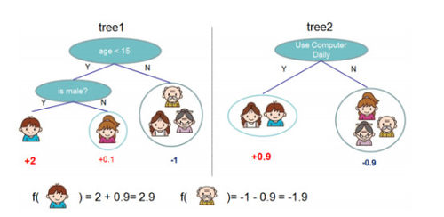

<center><font size=6>XGB算法原理</font></center>
算法思想就是不断地添加树，不断地进行特征分裂来生长一棵树，每次添加一个树，其实是学习一个新函数，去拟合上次预测的残差。当我们训练完成得到k棵树，我们要预测一个样本的分数，其实就是根据这个样本的特征，在每棵树中会落到对应的一个叶子节点，每个叶子节点就对应一个分数，最后只需要将每棵树对应的分数加起来就是该样本的预测值。

$$y\_hat=\sum_{k=1}^Kf_k(x_i)\newline
where F=\{f(x)=w_{q(x)}\}(q:R^m->T,w\in R^T)$$
　注：$w_{q(x)}$为叶子节点q的分数，f(x)为其中一棵回归树

　　如下图例子，训练出了2棵决策树，小孩的预测分数就是两棵树中小孩所落到的结点的分数相加。爷爷的预测分数同理。



<center><font size=6>XGB损失函数</font></center>
对于回归问题，我们常用的损失函数是MSE，即：

$$L(\theta)=\sum_i(y_i-\hat y_i)$$

对于分类问题，我们常用的损失函数是对数损失函数：
$$L(\theta)=\sum_i[y_iln(1+e^{-\hat y_i})+(1-y_i)ln(1+e^(\hat y_i))]$$
XGBoost目标函数定义为：
$$ 
\begin{array}{c}{O b j=\sum_{i=1}^{n} l\left(y_{i}, \hat{y}_{i}\right)+\sum_{k=1}^{K} \Omega\left(f_{k}\right)} \\ {\text { Training loss } \quad \text { Complexity of the Trees }} \\ {\text { where } \Omega(f)=\gamma T+\frac{1}{2} \lambda\|w\|^{2}}\end{array}
$$
目标函数由两部分构成，第一部分用来衡量预测分数和真实分数的差距，另一部分则是正则化项。正则化项同样包含两部分，T表示叶子结点的个数，w表示叶子节点的分数。γ可以控制叶子结点的个数，λ可以控制叶子节点的分数不会过大，防止过拟合。

　　正如上文所说，新生成的树是要拟合上次预测的残差的，即当生成t棵树后，预测分数可以写成：
$$ 
\hat{y}_{i}^{(t)}=\hat{y}_{i}^{(t-1)}+f_{t}\left(x_{i}\right)
 $$
同时，可以将目标函数改写成：
$$ 
\mathcal{L}^{(t)}=\sum_{i=1}^{n} l\left(y_{i}, \hat{y}_{i}^{(t-1)}+f_{t}\left(\mathbf{x}_{i}\right)\right)+\Omega\left(f_{t}\right)
 $$
 　　很明显，我们接下来就是要去找到一个f_t能够最小化目标函数。XGBoost的想法是利用其在f_t=0处的泰勒二阶展开近似它。所以，目标函数近似为：
 $$ 
\mathcal{L}^{(t)} \simeq \sum_{i=1}^{n}\left[l\left(y_{i}, \hat{y}^{(t-1)}\right)+g_{i} f_{t}\left(\mathbf{x}_{i}\right)+\frac{1}{2} h_{i} f_{t}^{2}\left(\mathbf{x}_{i}\right)\right]+\Omega\left(f_{t}\right)
 $$
 　　其中g_i为一阶导数，h_i为二阶导数：
 $$ 
g_{i}=\partial_{\hat{y}^{(t-1)}} l\left(y_{i}, \hat{y}^{(t-1)}\right), \quad h_{i}=\partial_{\hat{y}^{(t-1)}}^{2} l\left(y_{i}, \hat{y}^{(t-1)}\right)
 $$
 　　由于前t-1棵树的预测分数与y的残差对目标函数优化不影响，可以直接去掉。简化目标函数为：
 $$ 
\tilde{\mathcal{L}}^{(t)}=\sum_{i=1}^{n}\left[g_{i} f_{t}\left(\mathbf{x}_{i}\right)+\frac{1}{2} h_{i} f_{t}^{2}\left(\mathbf{x}_{i}\right)\right]+\Omega\left(f_{t}\right)
 $$
 　　上式是将每个样本的损失函数值加起来，我们知道，每个样本都最终会落到一个叶子结点中，所以我们可以将所以同一个叶子结点的样本重组起来，过程如下图：
 $$ 
\begin{aligned} O b j^{(t)} & \simeq \sum_{i=1}^{n}\left[g_{i} f_{t}\left(x_{i}\right)+\frac{1}{2} h_{i} f_{t}^{2}\left(x_{i}\right)\right]+\Omega\left(f_{t}\right) \\ &=\sum_{i=1}^{n}\left[g_{i} w_{q\left(x_{i}\right)}+\frac{1}{2} h_{i} w_{q\left(x_{i}\right)}^{2}\right]+\gamma T+\lambda \frac{1}{2} \sum_{j=1}^{T} w_{j}^{2} \\ &=\sum_{j=1}^{T}\left[\left(\sum_{i \in I_{j}} g_{i}\right) w_{j}+\frac{1}{2}\left(\sum_{i \in I_{j}} h_{i}+\lambda\right) w_{j}^{2}\right]+\gamma T \end{aligned}
 $$
 　　因此通过上式的改写，我们可以将目标函数改写成关于叶子结点分数w的一个一元二次函数，求解最优的w和目标函数值就变得很简单了，直接使用顶点公式即可。因此，最优的w和目标函数公式为
 $$ 
w_{j}^{*}=-\frac{G_{j}}{H_{j}+\lambda} \quad O b j=-\frac{1}{2} \sum_{j=1}^{T} \frac{G_{j}^{2}}{H_{j}+\lambda}+\gamma T
 $$
 <center><font size=6>分裂结点算法</font></center>
 在上面的推导中，我们知道了如果我们一棵树的结构确定了，如何求得每个叶子结点的分数。但我们还没介绍如何确定树结构，即每次特征分裂怎么寻找最佳特征，怎么寻找最佳分裂点。

　　正如上文说到，基于空间切分去构造一颗决策树是一个NP难问题，我们不可能去遍历所有树结构，因此，XGBoost使用了和CART回归树一样的想法，利用贪婪算法，遍历所有特征的所有特征划分点，不同的是使用上式目标函数值作为评价函数。具体做法就是分裂后的目标函数值比单子叶子节点的目标函数的增益，同时为了限制树生长过深，还加了个阈值，只有当增益大于该阈值才进行分裂。
<center><font size=6>正则化</font></center>
xgboost使用了如下的正则化项：
$$ 
\Omega(f)=\gamma T+\frac{1}{2} \lambda \sum_{j=1}^{T} w_{j}^{2}
 $$
 注意：这里出现了γ和λ，这是xgboost自己定义的，在使用xgboost时，你可以设定它们的值，显然，γ越大，表示越希望获得结构简单的树，因为此时对较多叶子节点的树的惩罚越大。λ越大也是越希望获得结构简单的树。
 <center><font size=6>对缺失值处理</font></center>
  xgboost模型却能够处理缺失值，模型允许缺失值存在。
　　　原始论文中关于缺失值的处理将其看与稀疏矩阵的处理看作一样。在寻找split point的时候，不会对该特征为missing的样本进行遍历统计，只对该列特征值为non-missing的样本上对应的特征值进行遍历，通过这个技巧来减少了为稀疏离散特征寻找split point的时间开销。在逻辑实现上，为了保证完备性，会分别处理将missing该特征值的样本分配到左叶子结点和右叶子结点的两种情形，计算增益后选择增益大的方向进行分裂即可。可以为缺失值或者指定的值指定分支的默认方向，这能大大提升算法的效率。如果在训练中没有缺失值而在预测中出现缺失，那么会自动将缺失值的划分方向放到右子树。
<center><font size=6>优缺点</font></center>
与GBDT相比，xgBoosting有以下进步：

1）GBDT以传统CART作为基分类器，而xgBoosting支持线性分类器，相当于引入L1和L2正则化项的逻辑回归（分类问题）和线性回归（回归问题）；

2）GBDT在优化时只用到一阶导数，xgBoosting对代价函数做了二阶Talor展开，引入了一阶导数和二阶导数；

3）当样本存在缺失值是，xgBoosting能自动学习分裂方向；

4）xgBoosting借鉴RF的做法，支持列抽样，这样不仅能防止过拟合，还能降低计算；

5）xgBoosting的代价函数引入正则化项，控制了模型的复杂度，正则化项包含全部叶子节点的个数，每个叶子节点输出的score的L2模的平方和。从贝叶斯方差角度考虑，正则项降低了模型的方差，防止模型过拟合；

6）xgBoosting在每次迭代之后，为叶子结点分配学习速率，降低每棵树的权重，减少每棵树的影响，为后面提供更好的学习空间；

7）xgBoosting工具支持并行,但并不是tree粒度上的，而是特征粒度，决策树最耗时的步骤是对特征的值排序，xgBoosting在迭代之前，先进行预排序，存为block结构，每次迭代，重复使用该结构，降低了模型的计算；block结构也为模型提供了并行可能，在进行结点的分裂时，计算每个特征的增益，选增益最大的特征进行下一步分裂，那么各个特征的增益可以开多线程进行；

8）可并行的近似直方图算法，树结点在进行分裂时，需要计算每个节点的增益，若数据量较大，对所有节点的特征进行排序，遍历的得到最优分割点，这种贪心法异常耗时，这时引进近似直方图算法，用于生成高效的分割点，即用分裂后的某种值减去分裂前的某种值，获得增益，为了限制树的增长，引入阈值，当增益大于阈值时，进行分裂；

然而，与LightGBM相比，又表现出了明显的不足：

1）xgBoosting采用预排序，在迭代之前，对结点的特征做预排序，遍历选择最优分割点，数据量大时，贪心法耗时，LightGBM方法采用histogram算法，占用的内存低，数据分割的复杂度更低；

2）xgBoosting采用level-wise生成决策树，同时分裂同一层的叶子，从而进行多线程优化，不容易过拟合，但很多叶子节点的分裂增益较低，没必要进行跟进一步的分裂，这就带来了不必要的开销；LightGBM采用深度优化，leaf-wise生长策略，每次从当前叶子中选择增益最大的结点进行分裂，循环迭代，但会生长出更深的决策树，产生过拟合，因此引入了一个阈值进行限制，防止过拟合.

<center><font size=6>sklearn参数</font></center>

```python
class XGBModel(XGBModelBase):
    # pylint: disable=too-many-arguments, too-many-instance-attributes, invalid-name
    """Implementation of the Scikit-Learn API for XGBoost.
    Parameters
    ----------
    max_depth : int
        Maximum tree depth for base learners.
    learning_rate : float
        Boosting learning rate (xgb's "eta")
    n_estimators : int
        Number of boosted trees to fit.
    silent : boolean
        Whether to print messages while running boosting.
    objective : string or callable
        Specify the learning task and the corresponding learning objective or
        a custom objective function to be used (see note below).
    booster: string
        Specify which booster to use: gbtree, gblinear or dart.
    nthread : int
        Number of parallel threads used to run xgboost.  (Deprecated, please use ``n_jobs``)
    n_jobs : int
        Number of parallel threads used to run xgboost.  (replaces ``nthread``)
    gamma : float
        Minimum loss reduction required to make a further partition on a leaf node of the tree.
    min_child_weight : int
        Minimum sum of instance weight(hessian) needed in a child.
    max_delta_step : int
        Maximum delta step we allow each tree's weight estimation to be.
    subsample : float
        Subsample ratio of the training instance.
    colsample_bytree : float
        Subsample ratio of columns when constructing each tree.
    colsample_bylevel : float
        Subsample ratio of columns for each split, in each level.
    reg_alpha : float (xgb's alpha)
        L1 regularization term on weights
    reg_lambda : float (xgb's lambda)
        L2 regularization term on weights
    scale_pos_weight : float
        Balancing of positive and negative weights.
    base_score:
        The initial prediction score of all instances, global bias.
    seed : int
        Random number seed.  (Deprecated, please use random_state)
    random_state : int
        Random number seed.  (replaces seed)
    missing : float, optional
        Value in the data which needs to be present as a missing value. If
        None, defaults to np.nan.
    importance_type: string, default "gain"
        The feature importance type for the feature_importances_ property: either "gain",
        "weight", "cover", "total_gain" or "total_cover".
    \*\*kwargs : dict, optional
        Keyword arguments for XGBoost Booster object.  Full documentation of parameters can
        be found here: https://github.com/dmlc/xgboost/blob/master/doc/parameter.rst.
        Attempting to set a parameter via the constructor args and \*\*kwargs dict simultaneously
        will result in a TypeError.
        .. note:: \*\*kwargs unsupported by scikit-learn
            \*\*kwargs is unsupported by scikit-learn.  We do not guarantee that parameters
            passed via this argument will interact properly with scikit-learn.
    Note
    ----
    A custom objective function can be provided for the ``objective``
    parameter. In this case, it should have the signature
    ``objective(y_true, y_pred) -> grad, hess``:
    y_true: array_like of shape [n_samples]
        The target values
    y_pred: array_like of shape [n_samples]
        The predicted values
    grad: array_like of shape [n_samples]
        The value of the gradient for each sample point.
    hess: array_like of shape [n_samples]
        The value of the second derivative for each sample point
    """
```
